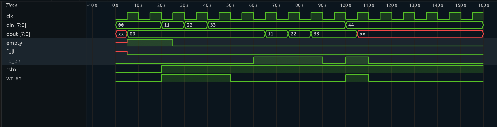

# Synchronous FIFO in Verilog

A simple **Synchronous FIFO (First In First Out)** memory designed in **Verilog HDL** and verified using **Icarus Verilog** and **Surfer waveform viewer**.

This project was built from scratch to understand:
- FIFO architecture
- Sequential logic
- Read/Write operations
- Pointer handling
- Count logic
- Full/Empty flag generation
- Verilog simulation and waveform debugging

---

# FIFO Architecture

The FIFO consists of:

- FIFO Memory Array
- Write Pointer (`wptr`)
- Read Pointer (`rptr`)
- Count Register (`count`)
- Full Flag
- Empty Flag

---

# Features

✅ Synchronous FIFO  
✅ Separate Read/Write Logic  
✅ Full and Empty Detection  
✅ FIFO Ordering Verification  
✅ Waveform Generation using VCD  
✅ Testbench for Simulation  
✅ Clocked Sequential Design  

---

# Technologies Used

- Verilog HDL
- Icarus Verilog
- Surfer Waveform Viewer
- VS Code

---

# Project Structure

```text
fifo/
│
├── sync_fifo.v
├── tb.v
├── dump.vcd
└── README.md
```

---

# FIFO Design

## FIFO Parameters

| Parameter | Value |
|---|---|
| Depth | 8 |
| Data Width | 8-bit |

---

# FIFO Ports

| Signal | Description |
|---|---|
| clk | Clock Signal |
| rstn | Active Low Reset |
| wr_en | Write Enable |
| rd_en | Read Enable |
| din | Input Data |
| dout | Output Data |
| full | FIFO Full Flag |
| empty | FIFO Empty Flag |

---

# Internal Working

## Write Operation

When:
```verilog
wr_en = 1
```

and FIFO is not full:

- Data is written into FIFO memory
- Write pointer increments
- Count increases

---

## Read Operation

When:
```verilog
rd_en = 1
```

and FIFO is not empty:

- Data is read from FIFO memory
- Read pointer increments
- Count decreases

---

# Full Condition

```verilog
assign full = (count == 8);
```

FIFO becomes full when 8 entries are occupied.

---

# Empty Condition

```verilog
assign empty = (count == 0);
```

FIFO becomes empty when no valid data is stored.

---

# Simulation

## Compile

```bash
iverilog -o fifo_sim sync_fifo.v tb.v
```

---

## Run Simulation

```bash
vvp fifo_sim
```

---

## Open Waveform

```bash
surfer ./dump.vcd
```

---

# Sample Simulation Output

```text
TIME=25 wr=1 rd=0 din=11 dout=00 full=0 empty=0
TIME=35 wr=1 rd=0 din=22 dout=00 full=0 empty=0
TIME=45 wr=1 rd=0 din=33 dout=00 full=0 empty=0

TIME=65 wr=0 rd=1 din=33 dout=11 full=0 empty=0
TIME=75 wr=0 rd=1 din=33 dout=22 full=0 empty=0
TIME=85 wr=0 rd=1 din=33 dout=33 full=0 empty=0
```

---

# Waveform Verification

The waveform verifies:

✅ Correct write operation  
✅ Correct read operation  
✅ FIFO ordering property  
✅ Empty flag behavior  
✅ Clock synchronization  

---

# FIFO Property Verified

Data exits in the same order it enters:

```text
11 → first out
22 → second out
33 → third out
```

This confirms proper FIFO behavior.

---

<p align="center">
  
</p>

# Future Improvements

- Handle simultaneous read/write correctly
- Add parameterized FIFO depth and width
- Add almost full/almost empty flags
- Add asynchronous FIFO support
- Add assertions and coverage
- Improve testbench with randomized testing

---

# Learning Outcomes

This project helped in understanding:

- Sequential Verilog Design
- FIFO Memory Architecture
- Pointer-Based Design
- Hardware Simulation
- Waveform Debugging
- RTL Verification Flow

---

# Author

Yashvi Doshi
